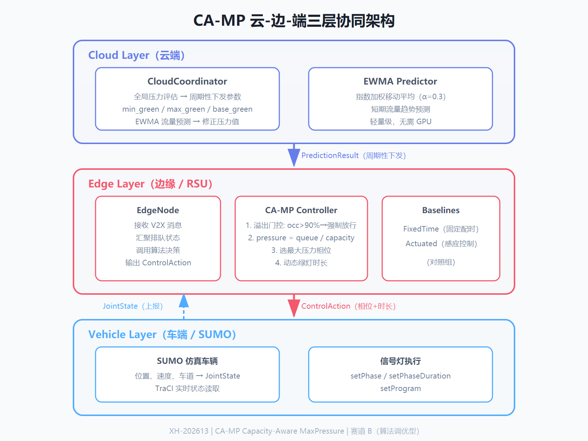
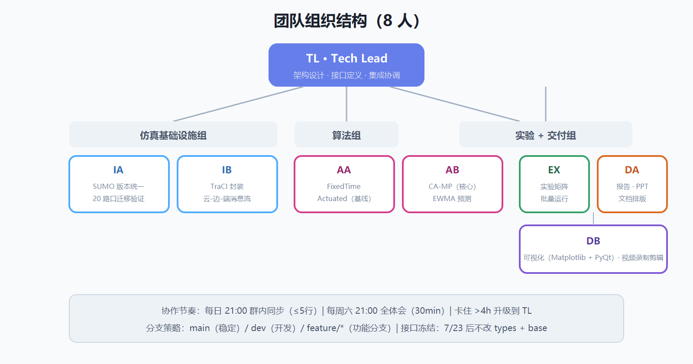
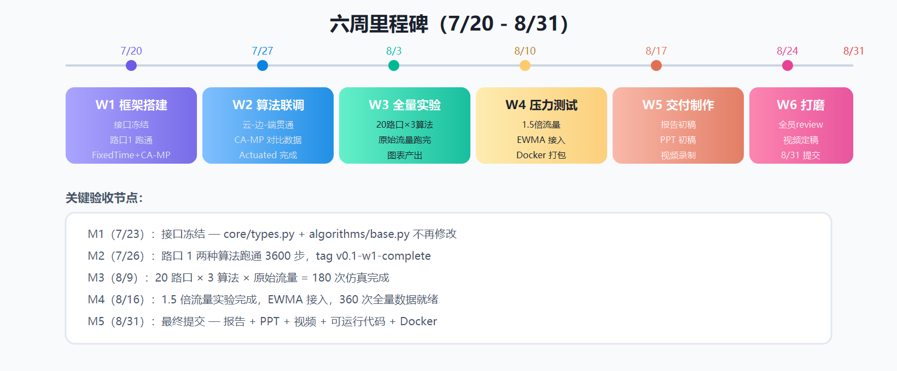

# 雄安新区"城市大脑"车路云一体化协同管控算法平台

[](https://www.tiaozhanbei.net)
[](docs/reference/competition/)
[](docs/reference/competition/)
[](https://www.python.org)
[](https://www.eclipse.org/sumo/)
[](LICENSE)

本项目为挑战杯 2026 参赛作品（编号 XH-202613），围绕雄安新区"城市大脑"车路云一体化场景，针对"窄路密网"交通特征（路口间距短、进口道容量低、排队回溢快），提出 **CA-MP（Capacity-Aware MaxPressure）** 信号控制算法。基于 SUMO 微观仿真平台，在 20 个真实路口上对比验证固定配时、感应控制、CA-MP 三种策略，形成可复现的车路云协同算法优化平台。

`main` 是稳定分支，功能改动应在独立分支完成，并通过 Pull Request 审查后合入。

---

<a id="目录"></a>

## 目录

- [项目概述](#项目概述)
- [仓库导航](#仓库导航)
- [快速开始](#快速开始)
- [协作指南](#协作指南)
- [项目结构](#项目结构)
- [数据说明](#数据说明)
- [系统架构](#系统架构)
- [核心算法](#核心算法)
- [实验设计](#实验设计)
- [团队分工](#团队分工)
- [开发计划](#开发计划)
- [提交材料](#提交材料)
- [许可与致谢](#许可与致谢)

---

<a id="项目概述"></a>

## 项目概述

<a id="竞赛信息"></a>

### 竞赛信息

| 项目 | 内容 |
|------|------|
| 竞赛 | 挑战杯 2026"揭榜挂帅" |
| 编号 | XH-202613 |
| 题目 | 面向雄安新区"城市大脑"的车路云一体化协同管控算法与仿真平台研究 |
| 出题方 | 雄安国创中心科技有限公司、中雄智图（雄安）科技有限公司 |
| 赛道 | 功能三 赛道 B（算法调优型） |
| 提交截止 | 2026 年 9 月 1 日（内部死线） |
| 团队规模 | 8 人 |

<a id="三大功能模块"></a>

### 三大功能模块

| 功能 | 核心内容 | 系统定位 |
|------|----------|----------|
| 功能一 | 智能交通协同管控算法的抽象设计与建模：场景建模、云-边-端数据接口设计、算法逻辑 | 设计层 |
| 功能二 | 高保真仿真验证平台：场景构建与数据导入、算法接入适配器、可视化验证、Docker 部署 | 平台层 |
| 功能三 | 经典交通管控算法的场景适配与深度优化：固定配时 -> 感应控制 -> CA-MP | 主战场 |

<a id="核心创新"></a>

### 核心创新（CA-MP 三项改进）

| # | 改进 | 经典 MaxPressure 的问题 | CA-MP 的解法 |
|---|------|------------------------|--------------|
| 1 | 容量归一化压力 | 绝对排队数偏向长车道，短车道（雄安 24m 短边）被忽视 | `pressure = queue / capacity`，短车道自动获得高优先级 |
| 2 | 溢出门控 | 窄路排队回溢堵死上游路口 | 进口道占用率 > 90% 时强制放行，防止死锁 |
| 3 | 云端动态绿灯 | 固定绿灯时长无法适应流量波动 | CloudCoordinator 根据全局压力周期性下发 `base_green`，边缘按压力比例动态分配 |

<a id="当前状态"></a>

### 当前状态

基础框架已完成，源码模块具备可运行骨架，队友可直接在对应文件中继续填充业务逻辑：

- 核心数据契约（`core/types.py`）已定义 JointState、ControlAction、SceneMeta 等共享类型。
- 场景注册（`scenes/registry.py`）已可自动发现 20 个路口，并兼容地图目录命名差异。
- 仿真引擎（`engine/`）已可启动 SUMO、读取状态、写入控制、输出 CSV。
- 算法库（`algorithms/`）已完成标准接口与三种策略骨架，固定配时基线支持 Excel 配时读取。
- 云端策略（`cloud/cloud_policy.py`）、REST API（`api/server.py`）、实验框架（`experiments/`）、可视化（`visualization/`）均已搭好骨架。

**IA（仿真基础设施 A）状态（2026-07-24）**：已完成 20 个路口在 SUMO 1.27.1 下的迁移、增强配置、边映射和批量验证；Docker 定义已就绪，真实跨机器镜像构建仍待验证。

**IB（仿真基础设施 B）状态（2026-07-24）**：已完成 TraCI 桥接、seed 透传、车辆采样与 500 上限、断线韧性、EdgeChannel、逐步日志、事件日志和实验 CLI；全量回归为 66 passed，固定配时与 CA-MP 3600 步均退出 0。

---

<a id="仓库导航"></a>

## 仓库导航

<a id="数据集"></a>

### 数据集

| 路径 | 说明 |
|------|------|
| `data/intersection_data/` | 20 个雄安路口原始数据，每个路口包含 SUMO 工程、流量与配时 Excel、高精地图 PNG |
| `data/intersection_data/metadata/` | 路口元数据汇总（intersections.csv + intersections.yaml） |
| `data/intersection_data.zip` | 上述路口数据的完整压缩包（66.7 MB），便于离线传输 |

数据内容详见 [数据说明](#数据说明)。

<a id="竞赛资料"></a>

### 竞赛资料

| 路径 | 说明 |
|------|------|
| [docs/reference/competition/](docs/reference/competition/) | 发榜单位提供的原始赛题资料，含功能要求、评分标准与提交说明 |

<a id="设计文档"></a>

### 设计文档

| 路径 | 说明 |
|------|------|
| [docs/team/project-roadmap.md](docs/team/project-roadmap.md) | 项目总路线图（六周里程碑、团队角色、实验设计、风险应对） |
| [docs/team/tasks/w1/](docs/team/tasks/w1/) 至 [docs/team/tasks/w6/](docs/team/tasks/w6/) | 各周个人任务书（8 人 x 6 周） |
| [docs/architecture/interface.md](docs/architecture/interface.md) | 数据契约、模块接口与架构说明 |
| [docs/operations/deployment.md](docs/operations/deployment.md) | 部署运行说明文档 |
| [docs/operations/sumo-environment-setup.md](docs/operations/sumo-environment-setup.md) | SUMO 环境安装指南 |
| [docs/reference/edge-mapping.md](docs/reference/edge-mapping.md) | 20 路口边 ID 到方向映射表 |
| [docs/reports/sumo-migration-log.md](docs/reports/sumo-migration-log.md) | SUMO 版本迁移记录 |
| [docs/reports/batch-validation-report.md](docs/reports/batch-validation-report.md) | 3600 步全量验证报告 |
| [docs/reports/w3-log-audit.md](docs/reports/w3-log-audit.md) | W3 日志审计报告 |
| [docs/reports/w5-verification.md](docs/reports/w5-verification.md) | W5 验证报告 |
| [docs/reports/w6-review-issues.md](docs/reports/w6-review-issues.md) | W6 审查问题记录 |
| [docs/README.md](docs/README.md) | 文档分类、规范入口与模块文档索引 |
| [docs/guides/](docs/guides/) | 协作指南（Git 工作流、Markdown、引用方法） |

---

<a id="快速开始"></a>

## 快速开始

<a id="环境要求"></a>

### 环境要求

- 操作系统：Windows 10/11（推荐）、Linux、macOS
- Python：3.10 或更高版本
- SUMO：1.27.1
- Git

<a id="安装-sumo"></a>

### 安装 SUMO

1. 访问 [Eclipse SUMO 官方下载页](https://www.eclipse.org/sumo/)。
2. 下载并安装 SUMO 1.27.1。
3. 设置环境变量 `SUMO_HOME`：
   - Windows：`SUMO_HOME = C:\Program Files (x86)\Eclipse\Sumo`
   - Linux/macOS：`export SUMO_HOME=/usr/share/sumo`
4. 将 `%SUMO_HOME%\bin` 或 `$SUMO_HOME/bin` 加入 `PATH`。
5. 验证安装：

```bash
sumo --version
```

<a id="安装-python-依赖"></a>

### 安装 Python 依赖

```bash
git clone https://github.com/WuHuMeow/ChallengeCup.git
cd ChallengeCup
python -m venv .venv
.venv\Scripts\activate        # Windows
# source .venv/bin/activate   # Linux/macOS
pip install -r requirements.txt
```

<a id="验证安装"></a>

### 验证安装

```bash
python -c "import traci; print('traci', traci.__version__)"
python -c "import pandas, numpy; print('all dependencies OK')"
```

<a id="运行最小示例"></a>

### 运行最小示例

路口数据已随仓库提交，位于 `data/intersection_data/`，无需额外配置路径。

```powershell
python examples/run_fixed_time.py 1
python examples/run_ca_max_pressure.py 1 3600
python experiments/runner.py --intersection 1 --algorithm ca_maxpressure `
  --flow-multiplier 1.5 --seed 42 --steps 3600 --output-dir output/exp1
```

启动 FastAPI 服务（可选）：

```bash
uvicorn api.server:app --reload
```

服务启动后访问 http://127.0.0.1:8000/docs 查看自动生成的 API 文档。多数 `/api/*` 协作路由仍为占位实现。

<a id="使用本地其他路径的数据"></a>

### 使用本地其他路径的数据（可选）

若需使用仓库外的路口数据，可通过环境变量覆盖：

```bash
# Windows
set CC_DATA_ROOT=C:\path\to\路口数据

# Linux/macOS
export CC_DATA_ROOT=/path/to/路口数据
```

<a id="验证命令"></a>

### 验证命令

```powershell
python -m pytest tests/ -q
python scripts/validation/validate_all.py
```

```bash
bash scripts/quality/lint_check.sh
```

---

<a id="协作指南"></a>

## 协作指南

如果你是第一次参与本仓库，建议先阅读以下指南：

| 指南 | 说明 |
|------|------|
| [Git 工作流](docs/guides/git-workflow.md) | 如何克隆仓库、提交修改、推送代码、解决冲突 |
| [Markdown 书写方法](docs/guides/markdown-guide.md) | README、任务书、报告常用 Markdown 语法 |
| [引用方法](docs/guides/citation-guide.md) | 如何规范引用文献、图片、代码和内部文档 |

### 分支策略

| 分支 | 用途 | 规则 |
|------|------|------|
| `main` | 稳定版本 | 只接受 PR merge，不直接 push |
| `dev` | 开发分支 | 每周日从 main 拉新分支 |
| `feature/<name>` | 功能分支 | 每人一个（如 `feature/algo-ca-mp`、`feature/infra-traci`） |

### 同步节奏

- **每日 21:00**：群内同步"今天完成 + 卡住的问题"（每人不超过 5 行）
- **每周六 21:00**：30 分钟全体同步会
- **卡住 > 4 小时**：群内升级到 TL

---

<a id="项目结构"></a>

## 项目结构

```text
ChallengeCup/
├── core/                       # 全项目共享核心
│   ├── types.py                # JointState / ControlAction / SceneMeta 等数据契约
│   └── config.py               # YAML 配置加载（支持 CC_DATA_ROOT 环境变量覆盖）
├── engine/                     # 仿真引擎（SUMO + TraCI）
│   ├── runner.py               # 单次仿真实验运行器（启动 -> 逐步 -> 决策 -> 采集 -> 关闭，优先使用增强版配置）
│   ├── traci_bridge.py         # TraCI 批量读写桥接（JointState <-> SUMO）
│   ├── collector.py            # 每 60 步状态与指标 CSV 采集
│   └── configs/                # 增强版 sumocfg x20（含 tripinfo/fcd/summary 输出与 GUI 自动播放）
├── scenes/                     # 场景管理
│   ├── registry.py             # 20 路口元数据索引（兼容高精地图/高清地图命名差异）
│   ├── variant.py              # 流量变体生成（1.0x / 1.5x）
│   └── timing_loader.py        # 从 Excel 读取信号配时方案（GBK 兼容）
├── algorithms/                 # 算法库
│   ├── base.py                 # BaseControlAlgorithm 标准接口（ABC）
│   ├── fixed_time.py           # 固定配时基线（支持 Excel 配时写入）
│   ├── rule_adaptive.py        # 感应控制 Actuated（排队阈值延长/切换）
│   └── ca_max_pressure.py      # CA-MP 容量感知最大压力
├── cloud/                      # 云端策略层
│   └── cloud_policy.py         # CloudCoordinator 全局参数下发 + EWMA 预测
├── ml/                         # ML 模型模块
│   ├── train.py                # EWMA 参数校准
│   ├── features.py             # 特征工程
│   └── evaluate.py             # 模型评估（MAE、RMSE）
├── api/                        # REST API（功能一要求）
│   └── server.py               # FastAPI 应用（场景管理、仿真控制、云-边-端接口）
├── experiments/                # 实验分析框架
│   ├── runner.py               # 多场景多算法交叉跑批（360 次仿真）
│   └── metrics.py              # 指标计算（排队、延误、吞吐量、油耗）
├── visualization/              # 可视化
│   └── plots.py                # Matplotlib 图表（对比曲线、热力图）
├── config/
│   └── default.yaml            # 全局配置
├── data/                       # 数据集
│   ├── intersection_data/      # 20 个路口原始数据（只读）
│   ├── intersection_data/metadata/  # 路口元数据（CSV + YAML）
│   └── intersection_data.zip   # 路口数据压缩包
├── examples/
│   └── run_fixed_time.py       # 最小可运行示例
├── scripts/
│   ├── data/                   # 元数据与边映射生成
│   ├── simulation/             # SUMO 配置生成与任务拆分
│   ├── validation/             # 环境、输出、seed 与压力验证
│   └── quality/                # lint 与静态检查
├── tests/
│   ├── unit/                   # 单模块行为测试
│   └── integration/            # 跨模块与真实流程测试
├── docs/
│   ├── architecture/           # 接口与架构图
│   ├── operations/             # 部署与 SUMO 环境
│   ├── reference/              # 边映射与赛题资料
│   ├── reports/                # 验证、迁移和审查报告
│   ├── team/                   # 路线图与六周任务书
│   └── guides/                 # 协作指南
├── output/                     # 运行时输出、历史归档与提交物
├── docker/                     # 容器化部署
│   └── Dockerfile              # ubuntu:22.04 + ppa:sumo/stable（SUMO 1.27.x）
├── docker-compose.yml          # 单容器编排（输出挂载宿主机）
├── .dockerignore               # Docker 构建上下文排除清单
├── requirements.txt
├── LICENSE                     # MIT
├── .gitignore
└── README.md
```

---

<a id="数据说明"></a>

## 数据说明

<a id="路口数据"></a>

### 路口数据

`data/intersection_data/` 包含 20 个雄安路口的原始数据，编号为 1 至 20。每个路口目录结构如下：

```text
intersection_data/{id}/
├── sumo工程/
│   ├── algorithm.py              # TraCI 启动模板（主办方提供）
│   ├── demo_{id}.net.xml         # SUMO 路网文件（路口几何、车道、信号灯）
│   ├── demo_{id}.rou.xml         # 车辆行驶路径（OD）
│   ├── demo_{id}.flow.xml        # 交通流量定义（各方向到达率）
│   ├── demo_{id}.turn.xml        # 转向比例定义
│   └── demo_{id}.sumocfg         # SUMO 仿真配置（步长、输出）
├── 路口数据/
│   └── demo_{id}流量和交叉口配时方案.xlsx
└── 高精地图/                      # 路口 11 为 "高清地图"，已做兼容处理
    └── demo_{id}.png
```

<a id="数据内容"></a>

### 数据内容

| 数据类型 | 文件 | 用途 |
|----------|------|------|
| SUMO 路网 | `.net.xml` | 路口几何、车道数、信号灯相位逻辑 |
| 车辆路径 | `.rou.xml` | 车辆 OD 与行驶路径 |
| 交通流量 | `.flow.xml` | 车辆在各方向的到达率 |
| 转向比例 | `.turn.xml` | 车辆在路口的左转、直行、右转比例 |
| 仿真配置 | `.sumocfg` | SUMO 运行参数（步长 1s 或 0.1s） |
| 流量与配时 | `.xlsx` | 早、平、晚高峰流量统计与三段信号配时方案 |
| 高精地图 | `.png` | 路口可视化底图 |

<a id="数据差异要点"></a>

### 数据差异要点

| 特征 | 说明 |
|------|------|
| SUMO 版本 | 原始数据使用多个版本；项目验证版本为 1.27.1 |
| 仿真步长 | 路口 1-10、14 为 1s；路口 11-13、15-20 为 0.1s |
| 额外输出 | 路口 11-13、15-20 有 queues.xml（queue-output） |
| 流量范围 | 183~834 辆/h/方向，各路口差异极大 |
| 边命名 | 不统一（E0/-E1/-E2/-E3，部分有 -E4/-E5，方向映射各异） |
| 地图目录 | 路口 11 为 `高清地图`，其余为 `高精地图`（代码已兼容） |

<a id="元数据"></a>

### 元数据

`data/intersection_data/metadata/` 提供所有路口的关键参数汇总：

- `intersections.csv`：结构化表格，供批量脚本读取
- `intersections.yaml`：带注释的 YAML 格式，含特殊路口说明

---

<a id="系统架构"></a>

## 系统架构



<a id="云-边-端协同框架"></a>

### 云-边-端协同框架

赛道 B 在单机进程内用模块边界模拟三层协同：

| 层级 | 模块 | 职责 | 数据契约 |
|------|------|------|----------|
| 云端 | `cloud/cloud_policy.py` | 全局压力评估，EWMA 流量预测，周期性下发参数 | `PredictionResult` |
| 边缘 | `algorithms/ca_max_pressure.py` | CA-MP 决策：容量归一化 + 溢出门控 + 动态绿灯 | `JointState` -> `ControlAction` |
| 车端/路侧 | `engine/traci_bridge.py` | 接收控制指令写入 SUMO，反馈车辆状态 | `JointState` |

<a id="仿真数据流"></a>

### 仿真数据流


每个仿真步的完整循环：

```text
SUMO step -> TraCI 读取 -> JointState -> CA-MP 决策 -> ControlAction -> 写入 SUMO -> 下一步
                                              ^
                                    CloudCoordinator（EWMA 修正）
```

---

<a id="核心算法"></a>

## 核心算法

<a id="ca-mp-决策逻辑"></a>

### CA-MP 决策逻辑

```python
def ca_mp_decide(state: JointState, prediction: PredictionResult) -> List[ControlAction]:
    # 1. 溢出门控：任何进口道占用率 > 90% -> 强制放行该方向
    for approach in state.queues:
        if approach.queue_length / approach.capacity > 0.9:
            return [ControlAction(tls_id=state.tls_id, action_type="set_phase",
                                  value=approach.phase, reason="溢出门控")]

    # 2. 容量归一化压力：pressure = queue / capacity
    pressures = {d: q.queue_length / q.capacity for d, q in state.queues.items()}
    best_phase = argmax(pressures)
    avg_pressure = mean(pressures.values())
    duration = clamp(base_green * (pressures[best_phase] / avg_pressure), min_green, max_green)
    return [ControlAction(tls_id=state.tls_id, action_type="set_phase_duration",
                          value=duration, reason="CA-MP 动态绿灯")]
```

<a id="算法对比"></a>

### 算法对比

| 算法 | 类型 | ML 介入 | 协同层级 | 实现文件 |
|------|------|---------|----------|----------|
| 固定配时 | 基线 | 无 | 无协同 | `algorithms/fixed_time.py` |
| 感应控制（Actuated） | 基线 | 无 | 边缘独立决策 | `algorithms/rule_adaptive.py` |
| **CA-MP** | **核心创新** | EWMA 流量预测 | 云-边协同 | `algorithms/ca_max_pressure.py` |

<a id="ewma-预测"></a>

### EWMA 流量预测

```text
predicted_flow(t+1) = alpha * observed_flow(t) + (1-alpha) * predicted_flow(t)
```

- alpha = 0.3（平滑系数，平衡响应速度与稳定性）
- 预测结果用于修正 CA-MP 的 pressure 计算，使决策具有前瞻性
- 轻量级：无需 GPU，单步计算 < 0.1ms

---

<a id="实验设计"></a>

## 实验设计

| 维度 | 方案 |
|------|------|
| 场景 | 20 个路口（主办方提供） |
| 算法 | CA-MP / FixedTime / Actuated（3 种） |
| 流量 | 原始流量 + 1.5 倍压力（2 档） |
| 重复 | 每组 3 次（随机种子 42 / 123 / 456） |
| **总计** | **20 x 3 x 2 x 3 = 360 次仿真** |
| 统计方法 | 配对 t 检验 |

### 评估指标

| 指标 | 来源 | 对应评分维度 |
|------|------|--------------|
| 平均行程时间（s） | tripinfo | 效率 |
| 平均排队长度（veh） | TraCI 实时读取 | 效率 |
| 总吞吐量（veh） | 到达目的地车辆数 | 效率 |
| 平均延误（s/veh） | 等待时间 | 效率 |
| 停车次数（次/veh） | tripinfo.stops | 安全/舒适 |
| 燃油消耗（mL） | tripinfo.fuelAbs | 能耗 |

### 重点验证路口

- **路口 16**：含 24m 短边进口道，CA-MP 容量归一化效果最显著
- **路口 11**：0.1s 步长 + 4 方向标准十字路口，验证步长兼容性
- **路口 1**：标准十字路口，边命名规范（E0/-E1/-E2/-E3），作为基准

### 已知限制

CA-MP 当前 MVI 档会产生非法 `set_phase` 值，TraCIBridge 会记录 warning 并跳过；真实算法效果仍由 AB 完成。部分实验指标仍是实时状态近似值，精确行程时间和燃油消耗需要 `tripinfo` 校准。ML 训练/预测和多数 `/api/*` 协同端点仍是占位实现。Docker 尚未完成跨机器真实镜像构建验证。

---

<a id="团队分工"></a>

## 团队分工



| 代号 | 角色 | 人数 | 职责概述 | 主要交付 | 进度（2026-07-24） |
|------|------|------|----------|----------|--------------------|
| TL | Tech Lead | 1 | 架构设计、接口定义、代码合入、集成协调 | `core/types.py` + `algorithms/base.py` + 集成 | 部分完成：核心契约、接口、文档 taxonomy 与集成验证已落地；最终集成和交付审查待完成 |
| IA | 仿真基础设施 A | 1 | SUMO 版本统一、20 路口迁移验证 | 20 路口可运行确认 | 已完成：20 路口迁移、增强配置、边映射和批量验证完成；Docker 实机构建待回填 |
| IB | 仿真基础设施 B | 1 | SumoSimulator 封装、TraCI 接口、云-边-端消息流 | `engine/` + 部署文档 | 已完成：TraCI、seed、采样、断线、EdgeChannel、step/events 日志和 CLI 已通过 66 项回归 |
| AA | 算法 A | 1 | FixedTimeController + ActuatedController（基线） | `fixed_time.py` + `rule_adaptive.py` | 基础实现完成：FixedTime 与 Actuated 控制器、测试和固定配时实跑已完成；全矩阵复核待完成 |
| AB | 算法 B | 1 | CAMaxPressureController（核心创新）+ EWMA 预测 | `ca_max_pressure.py` + `cloud/` + `ml/` | 进行中：CA-MP 管道可运行；MVI 相位值与真实算法效果待完成 |
| EX | 实验组 | 1 | 实验矩阵设计、批量运行、指标采集、统计分析 | `experiments/` + 360 次数据 | 部分完成：runner、seed/倍率、日志与 12 次审计已完成；360 次实验和精确指标待完成 |
| DA | 交付 A | 1 | 报告撰写、PPT 制作、文档排版 | 报告 + PPT | 待完成：技术 Markdown 已有；Word 报告、PPT 和提交排版待完成 |
| DB | 交付 B | 1 | 可视化（Matplotlib + PyQt 看板）、视频录制剪辑 | 图表 + 视频 | 部分完成：Matplotlib 绘图接口已有；PyQt 看板与演示视频待完成 |

### 个人任务书入口

| 代号 | 角色 | W1 | W2 | W3 | W4 | W5 | W6 |
|------|------|----|----|----|----|----|----|
| TL | Tech Lead | [W1](docs/team/tasks/w1/tl-technical-lead.md) | [W2](docs/team/tasks/w2/tl-technical-lead.md) | [W3](docs/team/tasks/w3/tl-technical-lead.md) | [W4](docs/team/tasks/w4/tl-technical-lead.md) | [W5](docs/team/tasks/w5/tl-technical-lead.md) | [W6](docs/team/tasks/w6/tl-technical-lead.md) |
| IA | 仿真基础设施 A | [W1](docs/team/tasks/w1/ia-infrastructure-a.md) | [W2](docs/team/tasks/w2/ia-infrastructure-a.md) | [W3](docs/team/tasks/w3/ia-infrastructure-a.md) | [W4](docs/team/tasks/w4/ia-infrastructure-a.md) | [W5](docs/team/tasks/w5/ia-infrastructure-a.md) | [W6](docs/team/tasks/w6/ia-infrastructure-a.md) |
| IB | 仿真基础设施 B | [W1](docs/team/tasks/w1/ib-infrastructure-b.md) | [W2](docs/team/tasks/w2/ib-infrastructure-b.md) | [W3](docs/team/tasks/w3/ib-infrastructure-b.md) | [W4](docs/team/tasks/w4/ib-infrastructure-b.md) | [W5](docs/team/tasks/w5/ib-infrastructure-b.md) | [W6](docs/team/tasks/w6/ib-infrastructure-b.md) |
| AA | 算法 A | [W1](docs/team/tasks/w1/aa-algorithm-a.md) | [W2](docs/team/tasks/w2/aa-algorithm-a.md) | [W3](docs/team/tasks/w3/aa-algorithm-a.md) | [W4](docs/team/tasks/w4/aa-algorithm-a.md) | [W5](docs/team/tasks/w5/aa-algorithm-a.md) | [W6](docs/team/tasks/w6/aa-algorithm-a.md) |
| AB | 算法 B | [W1](docs/team/tasks/w1/ab-algorithm-b.md) | [W2](docs/team/tasks/w2/ab-algorithm-b.md) | [W3](docs/team/tasks/w3/ab-algorithm-b.md) | [W4](docs/team/tasks/w4/ab-algorithm-b.md) | [W5](docs/team/tasks/w5/ab-algorithm-b.md) | [W6](docs/team/tasks/w6/ab-algorithm-b.md) |
| EX | 实验组 | [W1](docs/team/tasks/w1/ex-experiment.md) | [W2](docs/team/tasks/w2/ex-experiment.md) | [W3](docs/team/tasks/w3/ex-experiment.md) | [W4](docs/team/tasks/w4/ex-experiment.md) | [W5](docs/team/tasks/w5/ex-experiment.md) | [W6](docs/team/tasks/w6/ex-experiment.md) |
| DA | 交付 A | [W1](docs/team/tasks/w1/da-delivery-a.md) | [W2](docs/team/tasks/w2/da-delivery-a.md) | [W3](docs/team/tasks/w3/da-delivery-a.md) | [W4](docs/team/tasks/w4/da-delivery-a.md) | [W5](docs/team/tasks/w5/da-delivery-a.md) | [W6](docs/team/tasks/w6/da-delivery-a.md) |
| DB | 交付 B | [W1](docs/team/tasks/w1/db-delivery-b.md) | [W2](docs/team/tasks/w2/db-delivery-b.md) | [W3](docs/team/tasks/w3/db-delivery-b.md) | [W4](docs/team/tasks/w4/db-delivery-b.md) | [W5](docs/team/tasks/w5/db-delivery-b.md) | [W6](docs/team/tasks/w6/db-delivery-b.md) |

总路线图：[`docs/team/project-roadmap.md`](docs/team/project-roadmap.md)

---

<a id="开发计划"></a>

## 开发计划



| 阶段 | 时间 | 关键产出 | 里程碑 |
|------|------|----------|--------|
| W1 框架搭建 | 7/20-7/26 | 接口冻结；路口 1 固定配时 + CA-MP 跑通 3600 步 | M1（7/23 接口冻结） |
| W2 算法联调 | 7/27-8/2 | 云-边-端消息流贯通；CA-MP 对比数据；Actuated 完成 | M2（8/2 对比表） |
| W3 全量实验 | 8/3-8/9 | 20 路口 x 3 算法 x 原始流量跑完；图表产出 | M3（8/9 180 次完成） |
| W4 压力测试 | 8/10-8/16 | 1.5 倍流量完成；EWMA 接入；Docker 打包 | M4（8/16 360 次全量） |
| W5 交付制作 | 8/17-8/23 | 报告初稿、PPT 初稿、视频脚本 + 录制 | 报告 v2 |
| W6 打磨提交 | 8/24-8/31 | 全员 review、修 bug、视频定稿、最终提交 | M5（8/31 提交） |

---

<a id="提交材料"></a>

## 提交材料

根据赛题资料，2026 年 9 月 1 日前需提交：

| # | 材料 | 格式 | 负责人 | 状态 |
|---|------|------|--------|------|
| 1 | PPT 汇报 | .pptx | DA | 待完成 |
| 2 | 可运行仿真系统 + 源代码 | 代码仓库 | TL 集成 | 基础设施与目录整理已完成，算法/实验/交付继续集成 |
| 3 | 部署运行说明文档 | Markdown | IB | 已完成，路径为 `docs/operations/deployment.md` |
| 4 | 实验评估报告 | Word | DA + EX | 待完成 |
| 5 | 演示视频（5-8 分钟） | .mp4 | DB | 待完成 |
| 6 | 实际场景演示方案 | Word/Markdown | DA | 待完成 |
| 7 | Dockerfile + 部署文档 | Dockerfile + docs/ | IB | 文件已完成，真实镜像构建待验证 |

压缩包命名格式：`学校全称-团队名称-车路云协同管控算法与平台-负责人姓名`

---

<a id="许可与致谢"></a>

## 许可与致谢

[MIT](LICENSE)

本项目为挑战杯 2026 参赛作品，技术方案参考竞赛官方资料要求与雄安新区"城市大脑"车路云一体化场景需求。

### 参考资源

| 资源 | 说明 |
|------|------|
| [SUMO 官方文档](https://sumo.dlr.de/docs/) | 仿真平台文档 |
| [TraCI Python 接口](https://sumo.dlr.de/docs/TraCI.html) | SUMO 实时控制接口 |
| [MaxPressure (Varaiya 2013)](https://doi.org/10.1016/j.trb.2013.08.003) | 经典最大压力控制理论 |
| [LibSignal](https://github.com/LibSignal/LibSignal) | 多算法统一信号控制库 |
| [基于虚拟仿真的雄安新区道路交通系统分析](https://www.doc88.com/p-38873065731422.html) | 雄安路网特征参考 |
