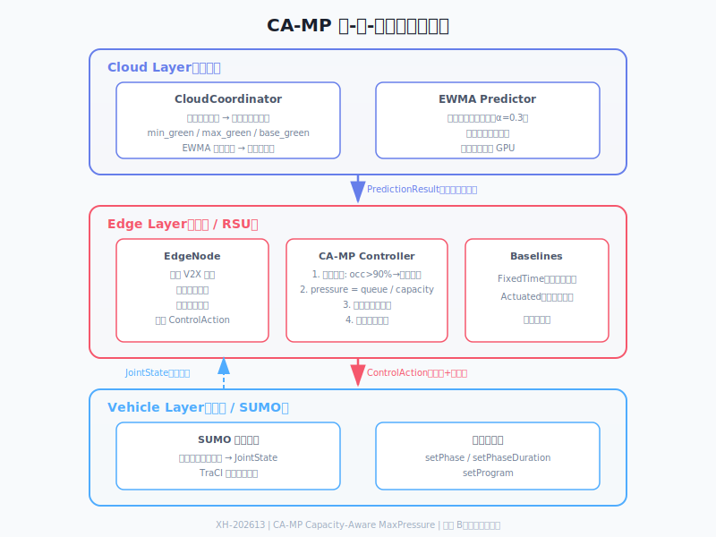

# Markdown 书写方法

> 本项目：雄安新区"城市大脑"车路云一体化协同感知算法平台（ChallengeCup，编号 XH-202613）

本指南说明本项目 README、任务书、报告、接口文档等文档中常用的 Markdown 语法，以及本项目特有的文档规范。

相关指南：
- [Git 工作流](./git-workflow.md)
- [引用方法](./citation-guide.md)

---

## 1. 标题

用 `#` 表示标题，`#` 越多级别越低：

```markdown
# 一级标题
## 二级标题
### 三级标题
```

---

## 2. 段落与换行

普通文字直接书写即可。两个换行表示一个新段落。

```markdown
这是第一段。

这是第二段。
```

---

## 3. 加粗、斜体、删除线

```markdown
**加粗**
*斜体*
~~删除线~~
```

效果：

**加粗**、*斜体*、~~删除线~~

---

## 4. 列表

### 无序列表

```markdown
- 项目 A
- 项目 B
  - 子项目 B1
  - 子项目 B2
```

效果：

- 项目 A
- 项目 B
  - 子项目 B1
  - 子项目 B2

### 有序列表

```markdown
1. 第一步
2. 第二步
3. 第三步
```

效果：

1. 第一步
2. 第二步
3. 第三步

---

## 5. 链接

```markdown
[显示文字](目标地址)
```

示例：

```markdown
[系统架构](../architecture/README.md)
```

---

## 6. 图片

```markdown

```

示例：

```markdown

```

> 提示：本项目架构图、数据流图等优先提供 SVG 格式（`architecture.svg`、`simulation-loop.svg`、`team-org.svg`、`dependencies.svg`、`timeline.svg`），可无限缩放。PNG 版本用于兼容性备份。

---

## 7. 代码

### 行内代码

```markdown
使用 `git status` 查看状态。
```

效果：使用 `git status` 查看状态。

### 代码块

用三个反引号包裹，并可在开头标注语言：

```markdown
```python
def hello():
    print("Hello, World!")
```
```

效果：

```python
def hello():
    print("Hello, World!")
```

---

## 8. 表格

```markdown
| 姓名 | 角色 | 任务 |
|------|------|------|
| 成员1 | 仿真引擎 | TraCI 封装 |
| 成员2 | 场景管理 | 20 路口场景 |
```

效果：

| 姓名 | 角色 | 任务 |
|------|------|------|
| 成员1 | 仿真引擎 | TraCI 封装 |
| 成员2 | 场景管理 | 20 路口场景 |

---

## 9. 引用

```markdown
> 这是一段引用。
```

效果：

> 这是一段引用。

---

## 10. 任务列表

```markdown
- [x] 已完成
- [ ] 未完成
```

效果：

- [x] 已完成
- [ ] 未完成

---

## 11. 分隔线

```markdown
---
```

效果：

---

## 12. 目录（TOC）

GitHub 会自动渲染标题为锚点，因此可以用链接手动生成目录：

```markdown
## 目录

- [项目概述](#项目概述)
- [快速开始](#快速开始)
```

---

## 13. 特殊字符转义

如果要在 Markdown 中显示 `*_[` 等字符，可在前面加反斜杠 `\`：

```markdown
\*这不是斜体\*
```

效果：\*这不是斜体\*

---

## 14. 中文排版建议

1. 中英文之间加空格：正确 `使用 Git 上传`，错误 `使用Git上传`。
2. 数字与单位之间不加空格：`180 次仿真` 正确，`180次 仿真` 错误。
3. 标题末尾不加句号。
4. 列表项保持语法一致，要么都用名词短语，要么都用完整句子。

---

## 15. 本项目文档结构

仓库中不同文档有不同定位，写之前先判断该放哪里：

| 目录 | 用途 | 示例 |
|------|------|------|
| `README.md` | 项目门面：竞赛信息、快速开始、项目结构、团队分工 | 仓库根目录 README |
| `docs/guides/` | 团队协作指南：Markdown、Git、引用 | 本文件、git-workflow.md |
| `docs/architecture/` | 当前架构、接口与系统图 | interface.md、images/ |
| `docs/operations/` | 环境安装、部署与运行说明 | deployment.md、sumo-environment-setup.md |
| `docs/team/tasks/` | 团队分工总览与个人任务书 | w1/ia-infrastructure-a.md |
| `docs/api-spec.md` | 接口文档（功能一要求） | REST API + Postman |
| `output/` | 提交材料：报告、PPT、视频、CSV | 答辩PPT.pptx、demo_video.mp4 |

## 16. 图片与 SVG 规范

### 16.1 推荐格式

- **架构图、数据流图、组织架构图**：优先使用 SVG，可无限缩放且体积小。
- **截图、照片**：使用 PNG 或 JPG。
- **PPT 用图**：导出 PNG/SVG，dpi ≥ 150。

### 16.2 本项目 SVG 清单

| SVG 文件 | 位置 | 说明 |
|----------|------|------|
| `architecture.svg` | `docs/architecture/images/` | 系统整体架构图 |
| `simulation-loop.svg` | `docs/architecture/images/` | 单步仿真循环与 ML 增强路径 |
| `team-org.svg` | `docs/architecture/images/` | 团队组织架构图 |
| `dependencies.svg` | `docs/architecture/images/` | 组间依赖关系图 |
| `timeline.svg` | `docs/architecture/images/` | 开发阶段甘特图 |
| `org-chart.svg` | `docs/architecture/images/` | 团队架构图（任务书用） |

### 16.3 引用示例

```markdown

```

## 17. 任务书写作规范

个人任务书统一放在 `docs/team/tasks/w1/` 至 `docs/team/tasks/w6/` 目录，并使用小写连字符角色文件名。

建议结构：

```markdown
# 人 X — 角色名称

## 角色定位

一句话说明你在项目中的位置和价值。

## 负责文件夹

| 文件夹 | 说明 |
|--------|------|
| `engine/` | 仿真引擎核心代码 |

## 待完成任务

### 第一优先级：M1 里程碑（7.25 前）

- [ ] 任务 1
- [ ] 任务 2

### 第二优先级：...

## 交付物

1. `engine/runner.py`
2. ...

## 关键约束

- 默认用 `sumo`，不用 `sumo-gui`
- ...

## 依赖链

```text
你 ← 依赖谁
  → 谁依赖你
```
```

## 18. 文档自检清单

提交文档前检查：

- [ ] 标题层级正确：只有 1 个 `#` 一级标题，二级用 `##`。
- [ ] 表格列数一致，分隔线完整。
- [ ] 代码块带语言标识（`python`、`bash`、`markdown` 等）。
- [ ] 链接能正常跳转，图片路径正确。
- [ ] 中英文之间加空格，数字与单位之间不加空格。
- [ ] 无错别字，无未完成的 TODO/TBD。
- [ ] SVG 图片无重叠、无超出画布。
- [ ] `docs/team/tasks/` 下的个人任务书链接可正常打开。

## 参考

- [GitHub Markdown 官方文档](https://docs.github.com/zh/get-started/writing-on-github/getting-started-with-writing-and-formatting-on-github)
- [Markdown 指南（中文）](https://www.markdownguide.org/)
