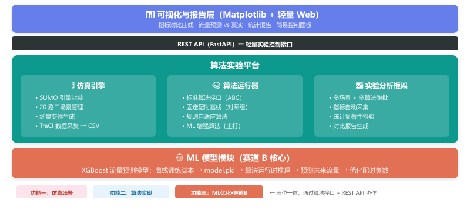
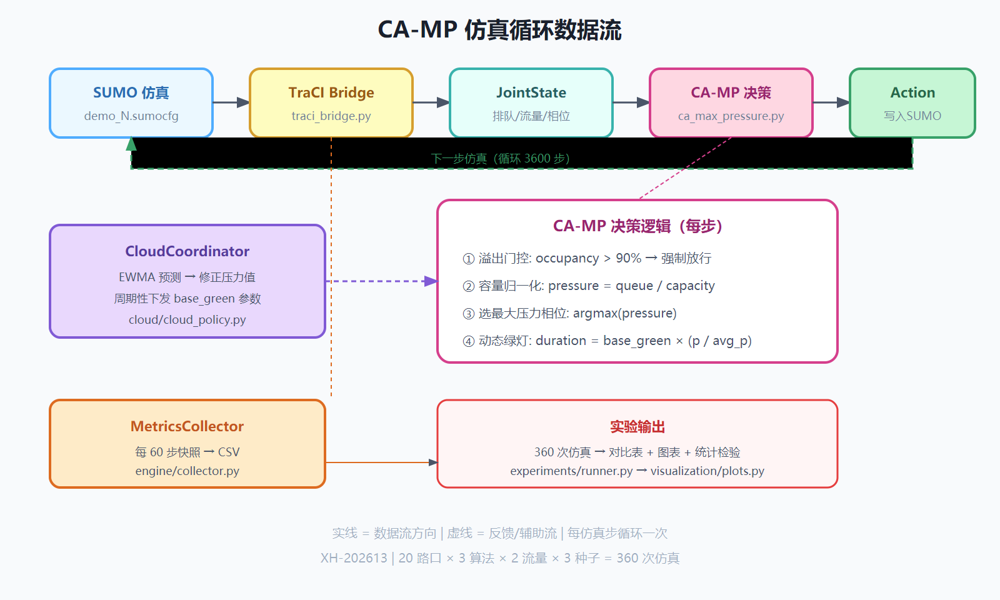
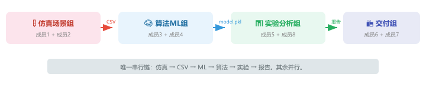
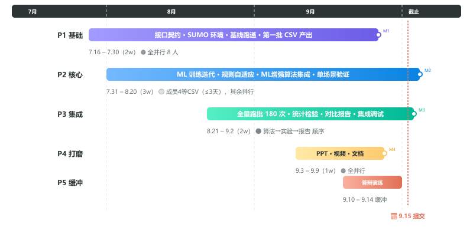

# 雄安新区"城市大脑"车路云一体化 — 系统设计文档

> **项目编号**：XH-202613
> **竞赛**：挑战杯 2026
> **赛道**：功能三 → 赛道 B（算法优化型）
> **方向**：ML 增强交通管控算法深度优化
> **提交截止**：2026 年 9 月 15 日
> **团队规模**：8 人（含 2 位负责人）
> **起点**：2026 年 7 月 16 日

---

## 一、项目概述

### 1.1 背景

雄安新区作为"未来之城"，其"城市大脑"需要一套智能化交通协同管控系统。本项目围绕"车-路-云"一体化架构，在雄安 20 个真实路口上完成交通管控算法的深度优化与对比验证。

### 1.2 三大功能模块

| 功能 | 核心内容 | 在本系统中的定位 |
|------|----------|-----------------|
| **功能一**：智能交通协同管控算法的抽象设计与建模 | 场景建模、**云-边-端**数据接口设计、算法逻辑设计、AI 决策模型（ML 增强） | 算法与协同框架的"设计层" |
| **功能二**：高保真仿真验证平台的通用性架构搭建 | 场景构建与数据导入、**扰动事件注入**、算法接入适配器、可视化验证、Docker 部署与性能优化 | 算法验证的"平台层" |
| **功能三（赛道B）**：经典交通管控算法的场景适配与深度优化 | 固定配时 → 规则自适应 → **ML 增强（XGBoost）**；多场景对比实验与实际场景演示 | **主战场**：AI 与传统控制融合 + 科学对比实验 |

### 1.3 赛道 B 要求（PDF 原文）

> 将一种具体的交通管控算法应用于雄安新区窄路密网场景中，并进行深度调优。
> 延伸方向：引入简单的机器学习模型预测流量、优化算法参数。

### 1.4 现有资源

- 20 个雄安路口 SUMO 工程（`.net.xml` + `.rou.xml` + `.flow.xml` + `.turn.xml` + `.sumocfg`）
- 20 个路口的交通流量与信号配时 Excel 数据
- 20 张高精地图 PNG
- `algorithm.py` 仅有 TraCI 启动骨架，无控制逻辑

---

## 二、整体架构

### 2.1 架构图



### 2.2 设计原则

- **聚焦算法深度**：核心资源投向 ML 模型训练 + 算法调优 + 科学对比实验
- **数据流驱动**：SUMO → CSV → 云端 ML 训练 → model.pkl → 边缘算法推理 → 车端/灯端执行 → 指标 → 报告
- **SUMO 是计算引擎**：用 `sumo`（命令行版）批量跑实验，不用 `sumo-gui`（太慢）
- **轻量接口**：FastAPI 仅提供实验控制（启动/停止/跑批），不做重型前后端分离

### 2.3 技术栈

| 层级 | 技术 | 用途 |
|------|------|------|
| 仿真引擎 | SUMO 1.18 + TraCI (Python) | 微观交通仿真 |
| 算法 | Python 3.x | 固定配时、规则自适应、ML 增强算法 |
| ML 模型 | XGBoost + scikit-learn | 流量预测、特征工程、模型评估 |
| 数据处理 | Pandas + NumPy | CSV 数据集构建、特征提取 |
| 后端服务 | FastAPI | 轻量实验控制 REST API |
| 可视化 | Matplotlib + Seaborn | 对比曲线、热力图、统计图表 |
| 统计检验 | SciPy | t 检验、Mann-Whitney U |
| Web（可选） | FastAPI + 简易 HTML | 轻量面板 |

### 2.4 云-边-端协同框架（赛道 B 轻量落地方案）

题目要求“设计并实现一个开源算法框架原型，明确定义云端策略模型、边缘协同规则与车载控制器之间的接口与数据流”。赛道 B 虽不强制要求像赛道 A 那样搭建完整的多机原型系统，但仍需在功能一中体现“车-路-云”一体化架构。本方案采用**轻量级三层抽象**，将 XGBoost ML 增强算法嵌入云-边协同链路：

```
┌─────────────────────────────────────┐
│  云端 Cloud Policy                  │  ← XGBoost 预测未来 5min 各方向流量
│  (cloud/cloud_policy.py)            │    输出：预测流量 + 全局策略参数
└──────────────┬──────────────────────┘
               │ HTTP/JSON 或进程内调用
               ▼
┌─────────────────────────────────────┐
│  边缘 Edge Controller               │  ← 接收云端预测，结合本地排队长度
│  (algorithms/ca_max_pressure.py)        │    执行规则融合决策，输出信号配时
└──────────────┬──────────────────────┘
               │ TraCI set_phase / set_vehicle_speed
               ▼
┌─────────────────────────────────────┐
│  车端 Vehicle / 路侧 RSU            │  ← SUMO 车辆接收建议车速（可选）
│  (engine/traci_bridge.py)           │    信号灯按边缘决策执行
└─────────────────────────────────────┘
```

**三层职责**

| 层级 | 模块 | 核心职责 | 在本项目中的落点 |
|------|------|----------|-----------------|
| **云端** | `cloud/cloud_policy.py` | 基于历史与实时数据做未来流量预测；输出全局策略参数 | XGBoost `model.pkl` + 预测服务封装 |
| **边缘** | `algorithms/ca_max_pressure.py` | 融合云端预测与本地排队状态，生成本地控制指令 | ML 增强算法主体 |
| **车端/路侧** | `engine/traci_bridge.py` | 接收控制指令并写入 SUMO；反馈车辆状态 | TraCI 读写封装 |

**接口契约**

```python
# cloud/cloud_policy.py
class CloudPolicy:
    def __init__(self, model_path: Path): ...
    def predict(self, state: JointState) -> PredictionResult:
        """返回未来 5 分钟各方向预测流量"""
        ...

# algorithms/ca_max_pressure.py
class CAMaxPressureAlgorithm(BaseControlAlgorithm):
    def __init__(self, cloud_policy: CloudPolicy): ...
    def step(self, state: JointState) -> list[ControlAction]:
        pred = self.cloud_policy.predict(state)
        # 结合预测 + 本地排队 → 生成 ControlAction
        ...
```

> 说明：为保持赛道 B 的算法深度，本框架在单机进程内运行，用模块边界模拟云/边/端三层。**不需要额外的物理机或开发板**，但代码结构和接口文档必须清晰体现三层协同逻辑。

---

## 三、平台核心详细设计

### 3.1 仿真引擎

| 模块 | 职责 |
|------|------|
| `engine/runner.py` | SUMO 启动/停止/重置，支持命令行批量运行 |
| `engine/traci_bridge.py` | TraCI 批量读写：车辆位置/速度/信号灯状态/排队长度 |
| `engine/collector.py` | 每个仿真步采集状态数据 → 输出 CSV（供 ML 训练用） |

**单步仿真循环**：



### 3.2 ML 模型模块（赛道 B 核心新增）

**数据流**：

```
SUMO 仿真(多场景跑批)
  → CSV 数据集（特征 + 标签）
    → XGBoost 训练脚本（离线）
      → model.pkl + 评估报告
        → 算法运行时加载 model.pkl
          → 推理预测 → 优化配时
```

| 阶段 | 产出 | 频率 |
|------|------|------|
| **训练数据生成** | 20 路口 × 3 流量等级 × 3600 步 = 216,000 条样本 | 跑 2-3 次（迭代调参） |
| **特征工程** | 历史流量窗口、排队长度趋势、时段编码、当前相位 | 训练脚本中定义 |
| **模型训练** | `ml/train.py`：XGBoost 回归 → `ml/model.pkl` | 离线，每次改特征/参数重跑 |
| **模型评估** | RMSE、MAE、R²；预测 vs 真实折线图 | 随训练输出 |
| **推理调用** | `model.predict(features)` 在算法 `step()` 中调用 | 每个仿真步（毫秒级） |

**特征与标签设计**：

| 类别 | 字段 | 说明 |
|------|------|------|
| 特征 | 前 5 分钟各方向通行量（4 方向 × 5 分钟 = 20 维） | 滑动窗口 |
| 特征 | 当前排队长度（4 方向） | 实时状态 |
| 特征 | 当前信号相位 | one-hot 编码 |
| 特征 | 时段类型（早高峰/平峰/晚高峰） | one-hot 编码 |
| 标签 | 未来 5 分钟各方向流量（4 维） | 回归预测 |

### 3.3 算法运行器

**标准算法接口**（Python ABC，与赛道 A 一致）：

```python
class BaseControlAlgorithm(ABC):
    def init(self, scene: Scene) -> None: ...
    def step(self, state: JointState) -> list[ControlAction]: ...
    def reset(self) -> None: ...
```

**三种算法递进**：

| 算法 | 定位 | ML 介入 | 协同层级 |
|------|------|---------|----------|
| **固定配时基线** | 对照组，读取 Excel 配时方案 | 无 | 无协同 |
| **规则自适应** | 中间对比态：根据实时排队长度动态调整绿灯时长 | 无 | 边缘独立决策 |
| **ML 增强算法**（主打） | 云端 XGBoost 预测 + 边缘规则融合：提前预判流量变化，主动调整配时 | 云端预测 4 方向未来流量，边缘执行控制 | **云-边协同** |

> **为什么不做多路口实时协同**：赛道 B 的核心是算法深度优化而非系统广度。我们在单个路口内实现“云端预测 → 边缘决策 → 车端/灯端执行”的协同链路，既满足题目对“云-边-端”框架的要求，又能清晰量化“加 ML 比纯规则好多少”。若后续时间充裕，可作为高级扩展尝试相邻路口的相位协调。

**ML 增强算法决策流程（云-边协同）**：

```
step(state):
  1. features = extract(state)                 # 边缘层提取 20+ 维本地特征
  2. pred_flow = cloud_policy.predict(state)   # 云端 XGBoost 预测未来 5min 各方向流量
  3. adjusted_timing = optimize(               # 边缘层：融合云端预测 + 本地排队
        current_queue,
        pred_flow,
        current_phase
     )
  4. return [set_phase(tl_id, adjusted_timing)]  # 车端/灯端执行
```

---

## 四、功能一/二：场景建模、数据接口与高保真仿真场景生成

> 对应 PDF：功能一（任务 1：场景建模与数据接口设计）+ 功能二（场景构建与数据导入）

### 4.1 场景管理

| 能力 | 说明 |
|------|------|
| **场景注册与索引** | 20 个路口场景统一注册，从 Excel 提取元数据（车道数、默认流量等级、信号配时方案） |
| **场景变体生成** | 每个路口生成 3 个流量等级（0.5x / 1.0x / 3.0x）→ 共 60 个变体，供 ML 训练和实验 |
| **场景校验** | 跑一轮无算法仿真，检查所有车辆是否完成行程 |
| **扰动事件注入** | 支持在施工占道、大型活动等扰动事件下生成临时场景变体 |

**对外接口**：

```python
class SceneManager:
    def list_scenes() -> list[SceneMeta]
    def get_scene(id) -> Scene
    def create_variant(id, params) -> Scene
    def validate(scene) -> ValidationResult
```

### 4.2 数据接口定义（功能一要求）

根据 PDF 功能一要求，需绘制"车-路-云"数据流图并定义 API：

| API 端点 | 方法 | 说明 |
|----------|------|------|
| `/api/scenes` | GET | 列出所有场景及元数据 |
| `/api/scenes/{id}/load` | POST | 加载指定场景 |
| `/api/simulation/start` | POST | 启动仿真 |
| `/api/simulation/stop` | POST | 停止仿真 |
| `/api/algorithm/switch` | POST | 切换算法 |
| `/api/experiments/run` | POST | 启动多场景跑批 |
| `/api/experiments/compare` | GET | 获取对比结果 |
| `/api/metrics/current` | GET | 当前仿真指标快照 |

> 接口文档使用 Swagger/OpenAPI 自动生成 + 手写关键说明，作为功能一提交物。

### 4.3 高保真仿真场景生成工具（功能二要求）

PDF 要求“研发一套适配雄安路网特点的仿真场景快速构建与参数化配置工具”，支持基于 OSM 或规划图纸生成仿真路网，并灵活注入施工占道、大型活动等扰动事件。本方案在现有 20 个路口 SUMO 工程基础上，补充轻量级场景生成与扰动注入能力：

**能力分层**

| 能力 | 实现 | 说明 |
|------|------|------|
| **路网批量生成** | `scenes/osm_importer.py` | 基于 OSM / 规划图纸生成 `.net.xml`、`.rou.xml`、`.flow.xml` 骨架（用于未来扩展；本次以出题单位提供的 20 个路口为主） |
| **参数化配置** | `scenes/variant.py` | 通过流量倍率、信号配时参数、车辆类型比例生成变体 |
| **扰动事件注入** | `scenes/perturbation.py` | 支持施工占道（关闭部分车道）、大型活动（临时增加 OD 流量）、学校上下学高峰等事件注入 |
| **场景验证** | `scenes/validator.py` | 跑一轮无算法仿真，检查死锁、未完成任务车辆比例 |

**扰动事件示例**

```python
# scenes/perturbation.py
class Perturbation:
    def apply(scene: SceneMeta, event: PerturbationEvent) -> SceneMeta

@dataclass
class ConstructionEvent:
    lane_ids: list[str]       # 被占用的车道
    duration_steps: int       # 持续仿真步数
    start_step: int           # 开始时间

@dataclass
class LargeActivityEvent:
    od_pairs: list[tuple[str, str]]  # 临时增加的起讫点
    flow_increase: float      # 流量增加倍数
    start_step: int
    end_step: int
```

> 说明：本次参赛以出题单位提供的 20 个路口为核心数据，场景生成工具重点体现“参数化配置 + 扰动注入”能力，OSM 批量导入作为可扩展接口保留。

---

## 五、功能一/二：算法逻辑实现、可视化验证与平台模块集成

> 对应 PDF：功能一（任务 2：算法逻辑设计与可视化仿真）+ 功能二（平台功能模块开发与集成）

### 5.1 算法实现

在仿真环境中实现三种交通控制策略，核心逻辑用 Python 编写。

参见 §3.3 算法运行器。

### 5.2 可视化验证

| 可视化 | 工具 | 说明 |
|--------|------|------|
| 单次仿真效果观察 | Matplotlib | 排队长度变化曲线、信号相位时序图 |
| 算法效果对比 | Matplotlib / Seaborn | 同一场景下三种算法指标并排对比 |
| 流量预测准确性 | Matplotlib | 预测值 vs 真实值散点图 + 残差分布 |

### 5.3 平台部署与性能优化（功能二要求）

PDF 功能二要求“研究并实践仿真平台的容器化部署，或对关键模块进行性能分析与简单优化”。本方案采用 Docker 容器化部署，确保评委可一键复现：

```
docker-compose up
  ├── SUMO 环境（sumo + sumo-tools）
  ├── Python 依赖（requirements.txt）
  ├── 仿真数据（scenes/data/ 只读挂载）
  ├── 云端预测服务（CloudPolicy）
  ├── 边缘控制入口（CAMaxPressureAlgorithm）
  └── FastAPI 服务（localhost:8000，含云/边/端接口）
```

**性能优化点**

| 优化项 | 策略 | 预期效果 |
|--------|------|----------|
| 批量仿真 | `sumo` 命令行版，禁用 GUI | 单次 3600 步约 1–3 分钟 |
| 断点续跑 | 跑批脚本检查已存在 CSV，跳过已完成实验 | 180 次仿真可分批完成 |
| 模型推理 | XGBoost C++ 底层，毫秒级单次预测 | 不影响仿真实时性 |

---

## 六、功能三：赛道 B — ML 增强算法深度优化、对比实验与实际场景演示

> 对应 PDF：功能三（赛道 B）+ 答题要求 4（实际场景应用演示方案与素材）

### 6.1 核心策略

```
固定配时基线 ──对比──→ 规则自适应 ──对比──→ ML 增强算法
   (0 ML)              (0 ML)              (XGBoost)
```

**验证路径**：两次对比，量化 ML 的增量价值：
1. 规则自适应 vs 固定基线 → "自适应能提升多少"
2. ML 增强 vs 规则自适应 → "AI 预测比纯规则好在哪"

### 6.2 实验设计

| 维度 | 方案 |
|------|------|
| **场景** | 20 个路口 × 3 个流量等级 = 60 个变体 |
| **算法** | 固定配时 / 规则自适应 / ML 增强 = 3 个 |
| **指标** | 平均排队长度、最大排队长度、平均车辆延误、**平均行程时间**、总通行量、停车次数、**燃油消耗** |
| **总实验次数** | 60 × 3 = 180 次仿真 |
| **统计方法** | 配对 t 检验（固定 vs 自适应 / 自适应 vs ML 增强） |

### 6.3 ML 模型训练与评估

| 步骤 | 产出 |
|------|------|
| 1. 数据采集 | 所有场景固定配时仿真的 CSV（含完整状态序列） |
| 2. 特征工程 | 滑动窗口 + one-hot + 归一化 |
| 3. 训练/验证/测试 | 70%/15%/15% 按路口分层划分（防数据泄漏） |
| 4. 模型选择 | XGBoost 回归（默认） vs 随机森林 vs 线性回归 → 选最优 |
| 5. 最终评估 | 测试集 RMSE + R² + 残差分析 |

### 6.4 预期创新点

- **AI 与传统控制融合**：不是纯 ML 端到端黑盒，而是 ML 预测 + 规则决策——保留可解释性
- **预测驱动的主动控制**：不等排队堆积再反应，提前根据预测流量预调配时
- **标准化对比实验**：20 路口 × 3 流量 × 3 算法，统计显著性支撑结论

### 6.5 实际场景演示方案（答题要求 4）

PDF 要求“选择雄安新区至少一个典型的实际交通场景”，并提交 5–8 分钟演示视频。本项目选定 **“雄安新区某学校周边人车混行路口晚高峰”** 作为 Demo 主线场景：

| 要素 | 内容 |
|------|------|
| **场景定义** | 学校周边窄路密网路口，晚高峰接学流与通勤流叠加，机非混行严重 |
| **问题描述** | 固定配时无法适应短时流量剧增，导致排队溢出、通行效率下降 |
| **算法适配** | 在该路口启用 ML 增强算法：云端根据历史数据预测 5 分钟后各方向流量，边缘层动态调整绿灯时长 |
| **对比演示** | 同一场景下固定配时 vs 规则自适应 vs ML 增强的三组指标实时对比 |
| **视频结构** | 问题引入（30s）→ 场景导入与云-边-端架构（60s）→ 算法部署运行（120s）→ 效果对比与数据指标叠加（120s）→ 总结（30s） |

> 说明：具体路口编号在 20 个 SUMO 工程中择优选择（优先选择流量波动大、存在明显高峰特征的路口）。Demo 视频由成员7 主导、成员8 配合录制，第 6 周输出脚本初稿，第 8 周完成最终版。

---

## 七、API 契约

### 7.1 REST API（轻量）

```
GET    /api/scenes               → 场景列表及元数据
POST   /api/scenes/{id}/load     → 加载指定场景
POST   /api/simulation/start     → 启动仿真
POST   /api/simulation/stop      → 停止仿真
GET    /api/algorithms            → 可用算法列表
POST   /api/algorithm/switch     → 切换算法
POST   /api/experiments/run      → 启动多场景跑批
GET    /api/experiments/compare   → 对比结果（JSON）
GET    /api/metrics/current       → 当前指标快照

# 云-边-端协同接口（功能一框架要求）
GET    /api/cloud/predict        → 云端流量预测（输入状态 → 返回未来流量）
POST   /api/edge/control         → 边缘控制决策（输入预测+本地状态 → 返回 ControlAction）
GET    /api/vehicle/status       → 车端/灯端状态快照
```

### 7.2 数据接口文档

功能一要求用 Postman/Apifox 定义并模拟测试关键 API，编写清晰的接口文档；同时需绘制“车-路-云”数据流图，体现云端预测、边缘决策、车端/灯端执行三层交互。产出：

- `docs/api-spec.md` — 接口定义文档
- `docs/数据流图.png` — 车-路-云数据流图
- Postman Collection JSON — 可直接导入

---

## 八、团队分工（8 人含 2 位负责人）

### 8.1 组织架构


### 8.2 详细分工

#### 仿真与场景组（成员1、成员2）

| 人 | 主责 | 副责 |
|----|------|------|
| **成员1** | SUMO 引擎封装（`engine/`）、TraCI 数据采集（→CSV）、命令行批量跑仿真 | 场景变体生成配合 |
| **成员2** | 20 路口场景注册管理（`scenes/`）、场景变体生成（3 个流量等级）、场景校验、**扰动事件注入** | SUMO 引擎性能优化 |

#### 算法与 ML 组（成员3、成员4）— 赛道 B 核心

| 人 | 主责 | 副责 |
|----|------|------|
| **成员3** | 算法接口设计（`algorithms/base.py`）、固定配时基线、规则自适应算法、**ML 增强算法（云-边协同：云端预测 + 边缘决策）**；**XGBoost 备选方案兜底** | ML 特征工程方案 |
| **成员4** | **XGBoost 云端流量预测模型全流程**：训练数据准备、特征工程、模型训练调参、模型评估、`model.pkl` 产出；**随机森林/LightGBM 备选模型** | 规则自适应算法配合 |

#### 实验分析组（成员5、成员8）

| 人 | 主责 | 副责 |
|----|------|------|
| **成员5** | 实验跑批框架（`experiments/runner.py`）、**27 次预跑批 + 180 次全量跑批**、指标自动采集与汇总；**Word 版实验评估报告** | 统计检验 |
| **成员8** | Matplotlib/Seaborn 报告图表、统计显著性检验、Docker 基础镜像；**Markdown→Word 报告转换** | 跑批实验配合 |

#### 可视化与交付（成员6、成员7）

| 人 | 主责 | 副责 |
|----|------|------|
| **🔷 成员6（后端负责）** | FastAPI 服务（`api/`）、**云-边-端协同 API 设计**（`/api/cloud/*`、`/api/edge/*`、`/api/vehicle/*`）、Postman 接口定义与文档（功能一要求）、后端集成、接口契约 | 实验分析配合 |
| **🧭 管理** | 后端 3 组接口对齐；站会；代码 Review；全链路集成 | |
| **🔶 成员7（前端负责）** | 算法效果可视化（功能二要求）、PPT 总设计、**Demo 视频脚本/录制/剪辑**（第 6 周脚本、第 7 周试录、第 8 周精剪） | 接口文档审校 |
| **🧭 管理** | 最终展示效果把控；视觉一致性；Demo 流程 | |

> 成员7 负载较重（可视化 + PPT + 视频），建议第 1 周即搭建 PPT 骨架，第 6 周前完成视频脚本，避免第 8 周集中爆发。

### 8.3 组间依赖



---

## 九、开发阶段与里程碑（9 周）

### 9.1 总览甘特图



### 9.2 第一阶段：基础搭建（7.16–7.30，2 周）

| 负责 | 内容 | 产出 |
|------|------|------|
| **全体** | 接口契约对齐；Git 分支策略；开发规范 | `docs/api-spec.md` |
| 成员1、成员2 | SUMO 环境配置；20 路口场景注册跑通；**产出第一批 CSV 数据** | `engine/` + CSV 样例 |
| 成员3 | 算法接口抽象类定稿；固定配时基线跑通第一个路口；**云-边-端算法接口初稿** | `algorithms/base.py` |
| 成员4 | XGBoost 环境搭建；阅读 CSV 格式；特征工程方案设计 | `ml/` 骨架 + 特征方案文档 |
| 成员5 | 实验跑批框架骨架 | `experiments/runner.py` |
| 成员6 | FastAPI 骨架 + API 端点清单 + **云-边-端协同接口设计** + Postman 接口定义 | `api/` 骨架 + `docs/数据流图.png` |
| 成员7 | Matplotlib 可视化骨架（单场景单车路口示例图） | 第一张示例图 |
| 成员8 | Docker 基础镜像 | Dockerfile |

**里程碑 M1（7.23）**：1 个路口固定配时跑通 + 第一批 CSV 数据产出 → **解除成员4 阻塞**

### 9.3 第二阶段：核心开发（7.31–8.20，3 周）

| 负责 | 内容 |
|------|------|
| 成员1、成员2 | 场景变体生成（3 个流量等级 × 20 路口）；20 路口全部数据采集 |
| 成员3 | 规则自适应算法完成；ML 增强算法框架（等 M2 后集成 model.pkl）；**云-边-端协同逻辑落地** |
| 成员4 | **XGBoost 训练（第 1 轮）** → 评估 → 调参（第 2-3 轮） → 产出 model.pkl；**云端预测服务封装** |
| 成员5 | 实验框架完善（指标采集、结果汇总）；**3 路口 × 3 流量 × 3 算法 = 27 次预跑批** → `experiments/` 预跑批通过 |
| 成员6 | FastAPI 完整实现；接口文档完善 |
| 成员7 | 可视化图表模板完善；**Demo 视频脚本初稿** → 视频脚本 v1 |
| 成员8 | Docker Compose 完成；Matplotlib 图表风格定稿；**统计分析脚本初版** → `experiments/analyzer.py` 初版 |

**里程碑 M2（8.5）**：XGBoost model.pkl v1 产出 + 规则自适应完成 → **解除成员3 阻塞**

**里程碑 M3（8.15–8.20）**：ML 增强算法集成完成 + 单场景三算法对比验证通过 → **解除成员5 阻塞**

### 9.4 第三阶段：集成联调（8.21–9.2，2 周）

| 负责 | 内容 |
|------|------|
| 成员5 | **全量跑批**：60 场景 × 3 算法 = 180 次仿真；跑批脚本支持断点续跑 |
| 成员1、成员2 | 配合成员5 处理异常场景（死锁、超时） |
| 成员3、成员4 | 分析实验结果，ML 模型可能微调；**备选模型（随机森林/LightGBM）兜底** |
| 成员5、成员8 | 统计检验 + 对比报告初稿 |
| 成员6 | 后端集成测试 |
| 成员7 | 报告图表美化；**Demo 视频试录一版** |

**里程碑 M4（8.28）**：180 次跑批完成 + 对比报告数据就绪 → **进入打磨**

### 9.5 第四阶段：打磨交付（9.3–9.9，1 周）

| 负责 | 内容 |
|------|------|
| **成员7（前端负责）** | PPT 总设计，全队提供素材；**Demo 视频精剪** |
| **成员8** | 配合成员7 录制/剪辑 Demo 视频；**将 Markdown 报告转换为 Word 格式** |
| **成员5、成员6** | 实验报告终稿 + API 文档终稿；**Word 版实验评估报告** |
| **全体** | 只修关键 Bug，不加新功能 |

**里程碑 M5（9.9）**：所有提交材料就位（含 Word/PPT/MP4/源码压缩包）

### 9.6 第五阶段：缓冲冲刺（9.10–9.14）

- 答辩模拟演练
- 最后一轮集成测试
- 9.15 前打包提交

### 9.7 关键依赖链

```
成员1,2(仿真CSV) ──→ 成员4(ML训练) ──→ 成员3(集成) ──→ 成员5(跑批) ──→ 成员7,8(报告/视频)
   M1(7.23)        M2(8.5)       M3(8.15)     M4(8.28)     M5(9.9)
```

### 9.8 时间投入预估

| 阶段 | 周数 | 人均每周 |
|------|------|----------|
| P1 基础搭建 | 2 周 | ~15h |
| P2 核心开发 | 3 周 | ~20h |
| P3 集成联调 | 2 周 | ~18h |
| P4 打磨交付 | 1 周 | ~15h |
| P5 缓冲冲刺 | 1 周 | ~10h |

---

## 十、目录结构

当前源码目录已建立骨架，各模块 `README.md` 说明职责，具体实现按开发阶段填充。

```text
ChallengeCup/
├── engine/                 # 仿真引擎
│   ├── README.md
│   ├── runner.py           # SUMO 生命周期管理（待实现）
│   ├── traci_bridge.py     # TraCI 批量读写（待实现）
│   └── collector.py        # 数据采集 → CSV（待实现）
├── scenes/                 # 场景管理（功能一）
│   ├── README.md
│   ├── registry.py         # 20 路口元数据索引（待实现）
│   ├── variant.py          # 场景变体生成（待实现）
│   ├── validator.py        # 场景校验（待实现）
│   ├── osm_importer.py     # OSM/规划图纸路网导入（可扩展接口）（待实现）
│   ├── perturbation.py     # 扰动事件注入（施工占道/大型活动）（待实现）
│   └── data/               # 20 个路口 SUMO 工程（待填充）
├── algorithms/             # 算法库（功能二 + 功能三）
│   ├── README.md
│   ├── base.py             # 标准算法接口（待实现）
│   ├── fixed_time.py       # 固定配时基线（待实现）
│   ├── rule_adaptive.py    # 规则自适应算法（待实现）
│   └── ca_max_pressure.py      # ML 增强算法（待实现）
├── ml/                     # ML 模型模块（赛道 B 核心）
│   ├── README.md
│   ├── train.py            # XGBoost 训练脚本（待实现）
│   ├── features.py         # 特征工程（待实现）
│   ├── evaluate.py         # 模型评估（待实现）
│   └── model.pkl           # 训练产出（待生成）
├── cloud/                  # 云端策略层（功能一云-边-端框架）
│   ├── README.md
│   └── cloud_policy.py     # 云端流量预测服务封装（待实现）
├── api/                    # REST API（功能一要求）
│   ├── README.md
│   ├── server.py           # FastAPI 应用（待实现）
│   └── routes/             # 路由（待实现）
├── experiments/            # 实验分析框架
│   ├── README.md
│   ├── runner.py           # 多场景多算法交叉跑批（待实现）
│   ├── metrics.py          # 指标采集（待实现）
│   └── analyzer.py         # 统计检验 + 报告（待实现）
├── visualization/          # 可视化
│   ├── README.md
│   ├── plots.py            # Matplotlib 图表（待实现）
│   └── report.py           # 报告生成（待实现）
├── config/
│   ├── README.md
│   └── default.yaml        # 全局配置（待创建）
├── docker/
│   ├── README.md
│   ├── Dockerfile          # 待创建
│   └── docker-compose.yml  # 待创建
├── output/                 # 提交材料与运行产物
│   └── README.md
├── docs/
│   ├── api-spec.md         # 接口文档（功能一产出，待创建）
│   ├── experiment-report.md # 实验报告（待创建）
│   ├── superpowers/
│   │   ├── plans/          # 实施计划
│   │   ├── specs/          # 设计文档与图片
│   │   │   └── images/
│   │   └── ...
│   └── team/               # 团队分工与个人任务书
│       ├── README.md
│       └── 成员1-仿真引擎/任务书.md
│       └── ...
├── requirements.txt        # Python 依赖
├── .gitignore
└── README.md
```

---

## 十一、评分对标

| 评分维度 | 满分 | 本项目设计对应 |
|----------|------|---------------|
| **创新性** | 25 | XGBoost 预测 + 规则融合的 AI 与传统控制结合；预测驱动主动控制 vs 传统被动响应；**云-边-端协同框架设计** |
| **系统实现与功能完成度** | 30 | 三种算法完整实现（基线 → 自适应 → ML增强）；20 路口 60 场景仿真验证；**云-边-端接口与数据流定义**；标准化 API 接口 |
| **实验验证与分析** | 20 | 180 次仿真跑批；多维度指标（排队/延误/通行量/停车次数/燃油消耗）；统计显著性检验；vs 传统信号控制对比 |
| **工程化与标准价值** | 10 | 标准算法接口（ABC）；**云-边-端分层接口规范**；接口文档（Postman）；场景变体生成标准化；Docker 可复现 |
| **团队答辩与表达** | 15 | 前后端负责人双层管理；PPT 专人 + 视频专人；模拟答辩演练 |

---

## 十二、提交材料清单（对照 PDF 第八点）

根据 PDF 要求，9 月 15 日前需向发榜单位邮箱提交以下材料：

| 材料 | 格式 | 负责人 | 路径/文件名 | 状态 |
|------|------|--------|-------------|------|
| 系统设计与算法报告 | Word（`.docx`） | 成员6、成员8 | `output/系统设计与算法报告.docx` | 待创建 |
| 答辩 PPT | PPT（`.pptx`） | 成员7 | `output/答辩PPT.pptx` | 待制作 |
| 可运行的仿真系统与算法源码 | 源代码（压缩包） | 全队 | 仓库根目录打包 | 开发中 |
| 完整的实验评估报告 | Word（`.docx`） | 成员5、成员8 | `output/实验评估报告.docx` | 待创建 |
| 系统演示视频 | MP4（5–8 分钟） | 成员7、成员8 | `output/demo_video.mp4` | 待录制 |
| 接口文档 + 数据流图 | Markdown / Postman Collection / PNG | 成员6 | `docs/api-spec.md`、`docs/数据流图.png`、`docs/postman_collection.json` | 待创建 |
| 参赛申报表（盖章 PDF） | PDF | — | 由学校/团队准备 | 待提交 |

> 邮件主题与压缩包命名格式：`学校全称-团队名称-车路云协同管控算法与平台-负责人姓名`

---

## 十三、风险识别与应对

| 风险 | 影响 | 应对策略 | 负责人 |
|------|------|----------|--------|
| **XGBoost 模型效果不佳**（R² < 0.5） | ML 增强算法无法体现优势，影响创新性得分 | ① 增加方向级、相位级特征；② 尝试随机森林、LightGBM 等备选模型；③ 保留“规则自适应 vs 固定配时”作为核心对比 | 成员4（主）、成员3（配合） |
| **3.0x 流量变体死锁** | 180 次跑批失败，影响实验完整性 | ① 第 5–6 周做 27 次预跑批暴露死锁路口；② 对死锁场景降流量或调信号配时；③ 记录不可行场景并从对比中剔除 | 成员2（主）、成员1（配合） |
| **全量跑批时间不足** | 第 7 周 180 次仿真跑不完 | ① 第 6 周完成三算法单场景验证；② 跑批脚本支持断点续跑；③ 准备低配机器并行方案 | 成员5（主）、成员1/成员8（配合） |
| **Demo 视频制作太晚** | 视频质量差，影响 10 分演示效果 | ① 第 6 周确定脚本和分镜；② 第 7 周试录一版；③ 第 8 周精剪 | 成员7（主）、成员8（配合） |
| **Docker 中 SUMO 环境异常** | 评委无法一键复现 | ① 第 2 周完成 Dockerfile 骨架；② 第 8 周换电脑验证；③ 提供 Windows/Linux 两套部署说明 | 成员8（主）、成员1（配合） |
| **接口契约不一致** | 各组代码无法集成 | ① 第 1 周接口对齐会议；② 每日站会同步；③ 成员6 统一维护接口文档 | 成员6 |

---

## 十四、自检清单

- [x] 无 TBD/TODO 占位符
- [x] 赛道 B 要求全部对照 PDF 原文确认（算法深度优化 + ML 预测流量 + 优化参数）
- [x] 三大功能覆盖完整：功能一（场景+API+云边端框架）、功能二（高保真仿真平台+算法可视化）、功能三（ML增强+实验）
- [x] 仿真场景生成工具：参数化配置 + 扰动事件注入（施工占道/大型活动）
- [x] 技术栈全部确定（SUMO + Python + XGBoost + FastAPI + Matplotlib）
- [x] ML 模型方案完整：训练数据来源（仿真CSV）→ 特征工程 → 训练 → 评估 → 推理
- [x] 评价指标覆盖 PDF 要求：排队长度、延误、行程时间、通行能力、燃油消耗
- [x] 实际演示场景已选定：学校周边人车混行路口晚高峰
- [x] 8 人分工主/副责 + 前后端负责人双管理
- [x] 里程碑有可验证产出标准（M1-M5，每个都有具体日期和解除阻塞说明）
- [x] 关键依赖链明确标注（仿真CSV → ML训练 → 算法集成 → 跑批 → 报告）
- [x] 风险识别与应对策略已记录
- [x] 提交材料清单对照 PDF 第八点完整列出
- [x] 所有日期基于 7.16 起点，9.15 截止
- [x] 实验规模量化（60 场景 × 3 算法 = 180 次仿真）
- [x] 评分标准每项都有明确对应
- [x] 无 MQTT 残留（赛道 A 专属内容已全部清除）
