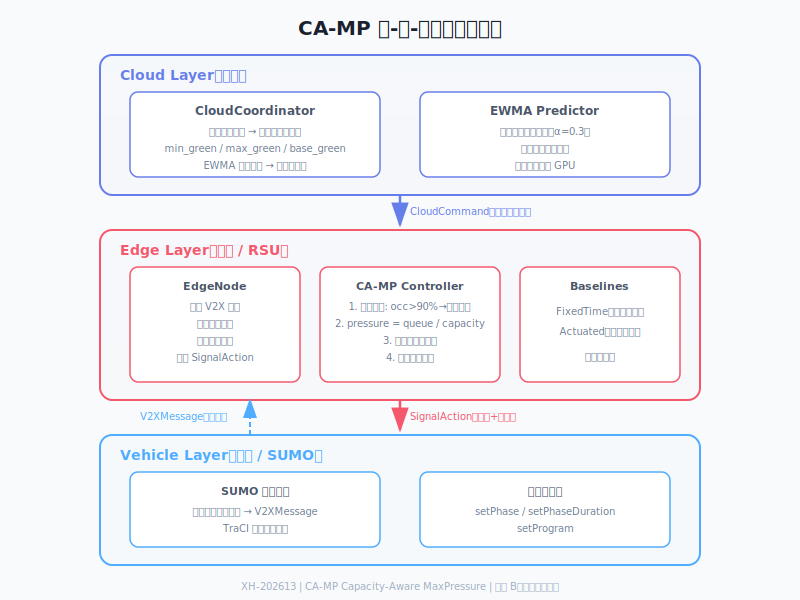
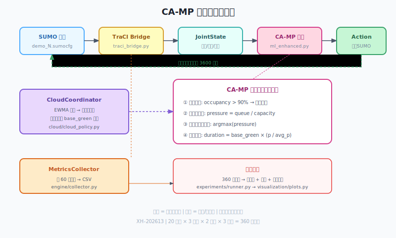

# 项目总路线图

> 项目编号：XH-202613
> 赛道：B（算法调优型）
> 核心算法：CA-MP（Capacity-Aware MaxPressure，容量感知最大压力控制）
> 截止日期：2026-09-01
> 团队规模：8 人

---

## 一、项目目标

将经典 MaxPressure 信号控制算法适配雄安新区"窄路密网"场景，通过三项创新改进（容量归一化压力、溢出门控、云端参数自适应）+ 轻量 EWMA 流量预测，在主办方提供的 20 个 SUMO 路口上完成全量实验验证，交付可运行系统、实验报告、PPT 及 5-8 分钟演示视频。

---

## 二、团队角色

| 代号 | 角色 | 人数 | 职责概述 |
|------|------|------|----------|
| TL | Tech Lead | 1 | 架构设计、接口定义、代码合入、集成协调 |
| IA | 仿真基础设施 A | 1 | SUMO 版本统一、20 路口迁移验证 |
| IB | 仿真基础设施 B | 1 | SumoSimulator 封装、TraCI 接口、云-边-端消息流 |
| AA | 算法 A | 1 | FixedTimeController + ActuatedController（基线） |
| AB | 算法 B | 1 | CAMaxPressureController（核心创新）+ EWMA 预测 |
| EX | 实验组 | 1 | 实验矩阵设计、批量运行、指标采集、统计分析 |
| DA | 交付 A | 1 | 报告撰写、PPT 制作、文档排版 |
| DB | 交付 B | 1 | 可视化（Matplotlib 图表 + PyQt 看板）、视频录制剪辑 |

---

## 三、六周里程碑

| 周 | 日期 | 里程碑 | 验收标准 |
|----|------|--------|----------|
| W1 | 7/20 - 7/26 | 框架搭建 | 单路口（路口1）固定配时 + CA-MP 均可跑通 3600 步；接口冻结 |
| W2 | 7/27 - 8/2 | 算法联调 | 云-边-端消息流贯通；CA-MP 在路口 1 出对比数据；感应控制基线完成 |
| W3 | 8/3 - 8/9 | 全量实验 | 20 路口 × 3 算法 × 原始流量第一轮跑完；Matplotlib 图表产出 |
| W4 | 8/10 - 8/16 | 压力测试 + 调优 | 1.5 倍流量实验完成；EWMA 预测接入；PyQt 看板（可选）；Docker 打包 |
| W5 | 8/17 - 8/23 | 交付物制作 | 报告初稿、PPT 初稿、视频脚本 + 录制完成 |
| W6 | 8/24 - 8/31 | 打磨提交 | 全员 review、修 bug、视频剪辑定稿、最终提交（8/31 前） |

---

## 四、技术架构





---

## 五、实验设计

- **路口**：20 个（主办方提供）
- **算法**：CA-MP / FixedTime / Actuated（3 种）
- **流量**：原始流量 + 1.5 倍压力（2 档）
- **重复**：每组 3 次（不同随机种子）
- **总计**：20 × 3 × 2 × 3 = 360 次仿真
- **指标**：平均行程时间、排队长度、吞吐量、油耗

---

## 六、交付物清单

| # | 交付物 | 格式 | 负责人 | 对应 PDF 要求 |
|---|--------|------|--------|---------------|
| 1 | PPT 汇报 | .pptx | DA | 答题要求第 1 条 |
| 2 | 可运行仿真系统 + 源代码 | 代码仓库 | TL 集成 | 答题要求第 2 条 |
| 3 | 部署运行说明文档 | docs/deployment.md | IB | 答题要求第 2 条 |
| 4 | 实验评估报告 | Word | DA + EX | 答题要求第 3 条 |
| 5 | 演示视频（5-8 分钟） | .mp4 | DB | 答题要求第 4 条 |
| 6 | 实际场景演示方案 | Word/Markdown | DA | 答题要求第 4 条 |
| 7 | Dockerfile + 部署文档 | Dockerfile + docs/ | IB | 工程化潜力（10 分） |

---

## 七、关键风险与应对

| 风险 | 影响 | 应对 |
|------|------|------|
| W1 接口未冻结 | 后续全部 delay | TL 必须在 7/23 前提交 messages.py + base.py |
| SUMO 版本迁移失败 | 部分路口无法运行 | IA 优先迁移路口 1/11/16，其余并行处理 |
| 360 次仿真机器时间不足 | 实验数据不完整 | W2 结束即开始排队跑；多台机器并行 |
| 算法效果不显著 | 报告无亮点 | 聚焦路口 16（24m 短边），该路口效果最明显 |
| 视频素材不足 | 演示环节丢分 | W3 开始每次实验都录屏存档 |

---

## 八、目录结构

```
ChallengeCup/
├── core/                        # 全项目共享核心
│   ├── types.py                 # JointState / ControlAction / SceneMeta 等数据契约
│   └── config.py                # YAML 配置加载
├── engine/                      # 仿真引擎（SUMO + TraCI）
│   ├── runner.py                # 单次仿真实验运行器
│   ├── traci_bridge.py          # TraCI 批量读写桥接
│   └── collector.py             # 每步状态与指标 CSV 采集
├── scenes/                      # 场景管理
│   ├── registry.py              # 20 路口元数据索引
│   ├── variant.py               # 流量变体生成
│   └── timing_loader.py         # 从 Excel 读取信号配时方案
├── algorithms/                  # 算法库
│   ├── base.py                  # BaseControlAlgorithm 标准接口（ABC）
│   ├── fixed_time.py            # 固定配时（基线）
│   ├── rule_adaptive.py         # 感应控制（Actuated 基线）
│   └── ca_max_pressure.py       # CA-MP（核心创新）
├── cloud/                       # 云端策略层
│   └── cloud_policy.py          # CloudCoordinator 全局参数下发
├── ml/                          # ML 模型模块（EWMA 预测）
│   ├── train.py                 # EWMA 参数校准
│   ├── features.py              # 特征工程
│   └── evaluate.py              # 模型评估
├── api/                         # REST API
│   └── server.py                # FastAPI 应用
├── experiments/                 # 实验分析框架
│   ├── runner.py                # 批量跑批
│   └── metrics.py               # 指标采集
├── visualization/               # 可视化
│   └── plots.py                 # Matplotlib 图表
├── config/
│   └── default.yaml             # 全局配置
├── data/                        # 数据集
│   ├── intersection_data/       # 20 路口原始数据（只读）
│   │   ├── 1/ ~ 20/
│   │   └── metadata/
│   └── intersection_data.zip
├── examples/
│   └── run_fixed_time.py        # 最小可运行示例
├── docs/
│   ├── pdf/                     # 赛题 PDF
│   ├── tasks/                   # 任务书（本目录）
│   │   ├── roadmap.md           # 本文件
│   │   └── w1/ ~ w6/           # 各周任务书
│   ├── guides/                  # 协作指南
│   └── superpowers/specs/       # 设计文档
├── docker/                      # 容器化部署（待实现）
├── requirements.txt
├── LICENSE
├── .gitignore
└── README.md
```
