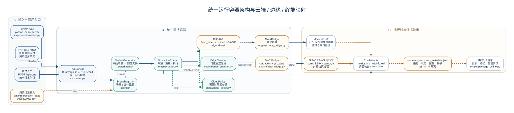
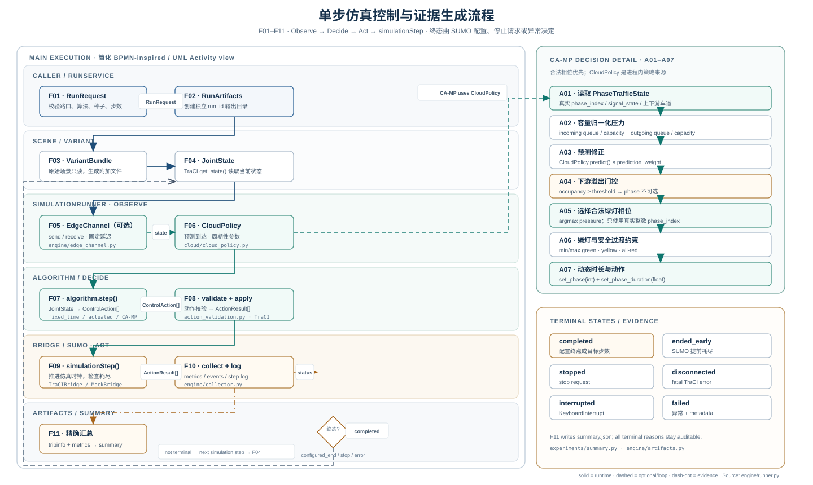

# 项目总路线图

> 项目编号：XH-202613
> 赛道：B（算法调优型）
> 核心算法：CA-MP（Capacity-Aware MaxPressure，容量感知最大压力控制）
> 截止日期：2026-09-01
> 团队规模：8 人

---

## 一、项目目标

将经典 MaxPressure 信号控制算法适配雄安新区"窄路密网"场景，通过三项创新改进（容量归一化压力、溢出门控、云端参数自适应）+ 轻量 EWMA 流量预测，在主办方提供的 20 个 SUMO 路口上完成全量实验验证，交付可运行系统、实验报告、PPT 及 5-8 分钟演示视频。

---

## 当前验证状态（2026-07-28）

本文件保留六周计划的原始日期、任务和阶段性记录；它们不是当前完成状态。当前仓库是内部研发仓库，PDF 要求功能一、功能二作为共同基础完成，并选择赛道 B 深入 CA-MP 的场景适配、参数调优和性能评估。

当前角色状态以 [当前分工完成情况](tasks/current-status.md) 为准。IA/IB 当前验证状态以 [最终验收记录](ia-ib-final-verification.md) 为准：13 项检查通过，Docker live 与第二机器复现保持 `not_run`。大型仿真结果及压缩包已删除，清理和重新生成方式见 [仿真产物清理记录](ia-ib-simulation-artifact-cleanup.md)。

当前主要缺口是 DA/DB 正式交付物、TL 最终集成审查、EX 正式数据重生成，以及 Docker/第二机器外部验证；PyQt 看板为可选项。

---

## 二、团队角色

| 代号 | 角色 | 人数 | 职责概述 |
|------|------|------|----------|
| TL | Tech Lead | 1 | 架构设计、接口定义、代码合入、集成协调 |
| IA | 仿真基础设施 A | 1 | SUMO 版本统一、20 路口迁移验证 |
| IB | 仿真基础设施 B | 1 | SumoSimulator 封装、TraCI 接口、云-边-端消息流 |
| AA | 算法 A | 1 | FixedTimeController + ActuatedController（基线） |
| AB | 算法 B | 1 | CAMaxPressureController（核心创新）+ EWMA 预测 |
| EX | 实验组 | 1 | 实验矩阵设计、批量运行、指标采集、统计分析 |
| DA | 交付 A | 1 | 报告撰写、PPT 制作、文档排版 |
| DB | 交付 B | 1 | 可视化（Matplotlib 图表 + PyQt 看板）、视频录制剪辑 |

---

## 三、六周里程碑

| 周 | 日期 | 里程碑 | 验收标准 | 当前状态（2026-07-28） |
|----|------|--------|----------|--------------------|
| W1 | 7/20 - 7/26 | 框架搭建 | 单路口（路口1）固定配时 + CA-MP 均可跑通 3600 步；接口冻结 | 基础代码链路已完成；CA-MP 以当前实现和测试为准 |
| W2 | 7/27 - 8/2 | 算法联调 | 云-边-端消息流贯通；CA-MP 在路口 1 出对比数据；感应控制基线完成 | 参数、种子、CloudPolicy、EdgeChannel 和日志链路已完成 |
| W3 | 8/3 - 8/9 | 全量实验 | 20 路口 × 3 算法 × 原始流量第一轮跑完；Matplotlib 图表产出 | 批量实验框架、审计、断线恢复和可视化契约已完成；正式产物需重生成 |
| W4 | 8/10 - 8/16 | 压力测试 + 调优 | 1.5 倍流量实验完成；EWMA 预测接入；PyQt 看板（可选）；Docker 打包 | 压力保障、EWMA、Docker 静态文件完成；Docker live 未运行，PyQt 未实现 |
| W5 | 8/17 - 8/23 | 交付物制作 | 报告初稿、PPT 初稿、视频脚本 + 录制完成 | IA/IB 工程收尾完成（当前完整测试 198 passed）；DA/DB 正式交付物缺失 |
| W6 | 8/24 - 8/31 | 打磨提交 | 全员 review、修 bug、视频剪辑定稿、最终提交（8/31 前） | 未完成；最终 review、材料打包和提交无直接证据 |

---

## 四、技术架构





---

## 五、实验设计

- **路口**：20 个（主办方提供）
- **算法**：CA-MP / FixedTime / Actuated（3 种）
- **流量**：原始流量 + 1.5 倍压力（2 档）
- **重复**：每组 3 次（不同随机种子）
- **总计**：20 × 3 × 2 × 3 = 360 次仿真
- **指标**：平均行程时间、排队长度、吞吐量、油耗

---

## 六、交付物清单

| # | 交付物 | 格式 | 负责人 | 对应 PDF 要求 |
|---|--------|------|--------|---------------|
| 1 | PPT 汇报 | .pptx | DA | 答题要求第 1 条 |
| 2 | 可运行仿真系统 + 源代码 | 代码仓库 | TL 集成 | 答题要求第 2 条 |
├── docs/
│   ├── 总路线.md              # 项目路线图（本文件）
│   ├── interface.md            # 数据契约与模块接口
│   ├── deployment.md           # 部署说明
│   ├── sumo_env_setup.md       # SUMO 环境说明
│   ├── tasks/                  # W1-W6 任务书与 Gitee 路线图
│   ├── guides/                 # 协作与运行指南
│   ├── superpowers/            # 设计规格、实施计划和架构图
│   └── pdf/                    # 赛题 PDF
├── docker/                      # 容器化部署（待实现）
├── requirements.txt
├── LICENSE
├── .gitignore
└── README.md
```
